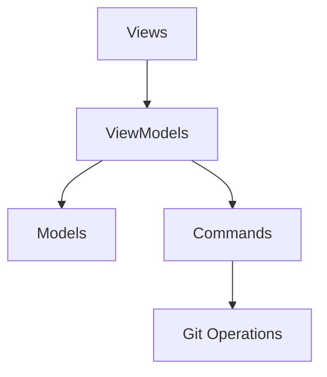
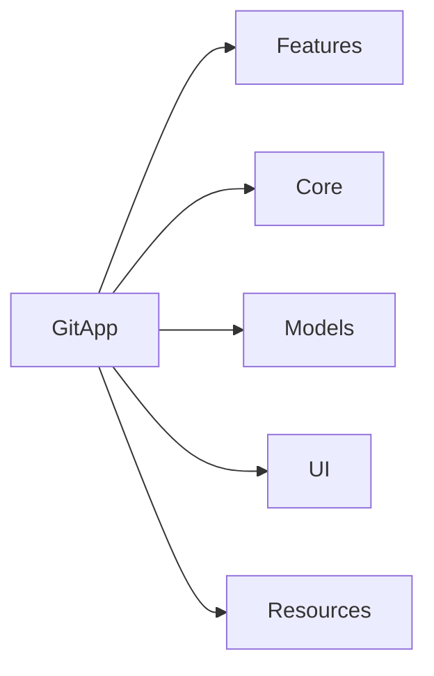
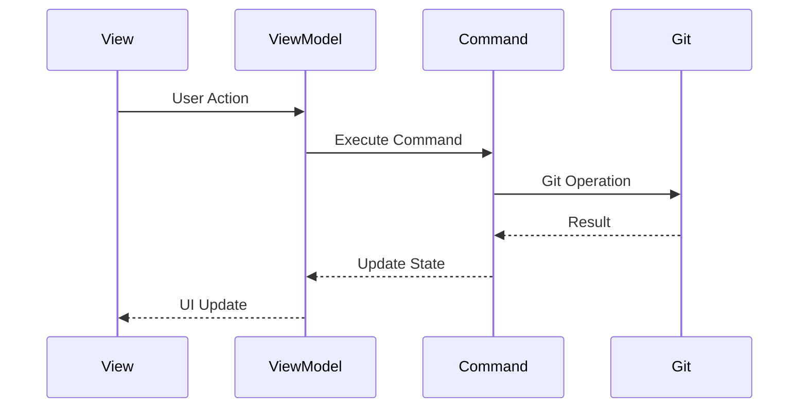

# GitApp - Modern Git Client for macOS

A modern, SwiftUI-based Git client for macOS that provides an intuitive interface for version control operations.

## 📸 Screenshots

### Main Interface
 ## History View 


*History View with showing commits,branches,remotes and commit detail*

### Commit View


*Commit View and Staged and unstaged files*

## 🏗 Architecture

The project follows MVVM (Model-View-ViewModel) architecture with a clear separation of concerns:



### Core Components



## 📁 Project Structure

```
GitApp/
├── Features/
│   └── Git/
│       ├── Views/
│       │   ├── Components/
│       │   ├── Commits/
│       │   ├── FilesViews/
│       │   └── SideBar/
│       └── ViewModels/
├── Core/
│   └── Commands/
│       ├── GitBasicOperations/
│       ├── GitBranch/
│       ├── GitCommit/
│       ├── GitDiff/
│       ├── GitMerge/
│       ├── GitRestore/
│       ├── GitStash/
│       └── GitTags/
├── Models/
└── Resources/
```

## 🔄 Data Flow



## 🎯 Key Features

- Repository Management
- Branch Operations
- Commit History
- File Diff Viewing
- Stash Management
- Tag Management
- Merge Operations

## 📦 Core Components

### Models

- `Branch`: Branch information and operations
- `Commit`: Commit data structure
- `Diff`: File difference representation
- `FileDiff`: Detailed file changes
- `Status`: Repository status
- `Stash`: Stash operations
- `Tag`: Tag management

### Commands

- Basic Operations (clone, checkout, reset)
- Branch Management
- Commit Operations
- Diff Generation
- Merge Handling
- Stash Operations
- Tag Management

### ViewModels

- `GitViewModel`: Main Git operations coordinator
- `RepositoryViewModel`: Repository management
- `LogStore`: Commit history management
- `SyncState`: Repository synchronization state

## 🎨 UI Components

### Main Views

- `GitClientView`: Main application interface
- `RepositorySelectionView`: Repository selection and management
- `HistoryView`: Commit history visualization
- `CommitView`: Commit details and operations
- `CloneRepositoryView`: Repository cloning interface

### Feature Views

- Branch Management
  - `CreateBranchSheet`
  - `RenameBranchSheet`
  - `DeleteBranchesView`
- Stash Operations
  - `CreateStashSheet`
- Sync Operations
  - `PullSheet`
  - `PushSheet`

## 🛠 Technical Stack

- SwiftUI for UI
- Swift Concurrency (async/await)
- Combine for reactive programming
- Git command-line interface integration
- Modern Swift features and best practices

## 🔒 Security

- Secure credential handling
- Safe file operations
- Protected Git operations

## 📱 Requirements

- macOS 14.0+
- Xcode 16.0+
- Swift 5.7+

## 🚀 Getting Started

1. Clone the repository
2. Open `GitApp.xcodeproj`
3. Build and run the project

## 📝 License

MIT License

Copyright (c) 2024 GitApp

Permission is hereby granted, free of charge, to any person obtaining a copy
of this software and associated documentation files (the "Software"), to deal
in the Software without restriction, including without limitation the rights
to use, copy, modify, merge, publish, distribute, sublicense, and/or sell
copies of the Software, and to permit persons to whom the Software is
furnished to do so, subject to the following conditions:

The above copyright notice and this permission notice shall be included in all
copies or substantial portions of the Software.

THE SOFTWARE IS PROVIDED "AS IS", WITHOUT WARRANTY OF ANY KIND, EXPRESS OR
IMPLIED, INCLUDING BUT NOT LIMITED TO THE WARRANTIES OF MERCHANTABILITY,
FITNESS FOR A PARTICULAR PURPOSE AND NONINFRINGEMENT. IN NO EVENT SHALL THE
AUTHORS OR COPYRIGHT HOLDERS BE LIABLE FOR ANY CLAIM, DAMAGES OR OTHER
LIABILITY, WHETHER IN AN ACTION OF CONTRACT, TORT OR OTHERWISE, ARISING FROM,
OUT OF OR IN CONNECTION WITH THE SOFTWARE OR THE USE OR OTHER DEALINGS IN THE
SOFTWARE.

## 👥 Contributing

