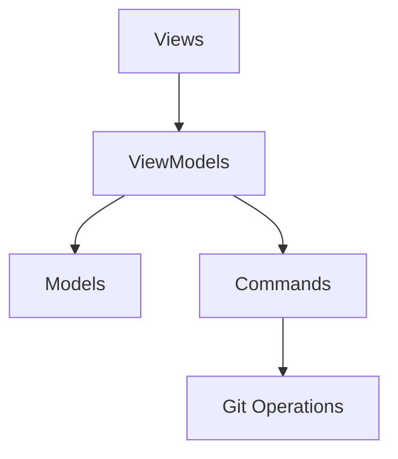

# 🚀 GitApp - Modern Git Client for macOS

A modern, SwiftUI-based Git client that brings the power of Git to your fingertips with a beautiful, intuitive interface.

[Features](#-key-features) • [Architecture](#-architecture) • [Installation](#-getting-started) • 

## 🎯 Key Features

- Repository Management
- Branch Operations
- Commit History
- File Diff Viewing
- Stash Management
- Tag Management
- Merge Operations
## 🏗 Architecture

The project follows MVVM (Model-View-ViewModel) architecture with a clear separation of concerns:

## 🛠 Technical Stack

- SwiftUI for UI
- Swift Concurrency (async/await)
- Combine for reactive programming
- Git command-line interface integration
- Modern Swift features and best practices

## 📱 Requirements

- macOS 14.0+
- Xcode 16.0+
- Swift 5.7+

## 🚀 Getting Started

1. Clone the repository
2. Open `GitApp.xcodeproj`
3. Build and run the project

## 📝 License

This project is licensed under the MIT License - see the [LICENSE](LICENSE) file for details.

## 👥 Contributing
Contributions are welcome! Feel free to open an issue or submit a pull request.

## 🌟 Support
If you find this project helpful, give it a ⭐ on GitHub!
