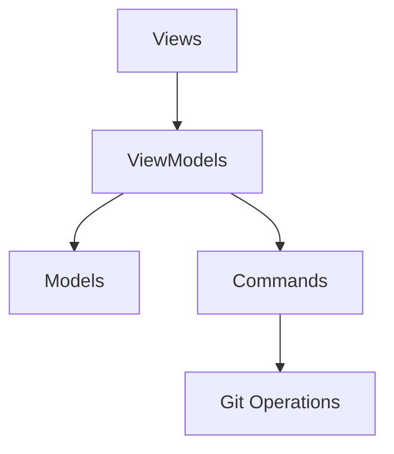
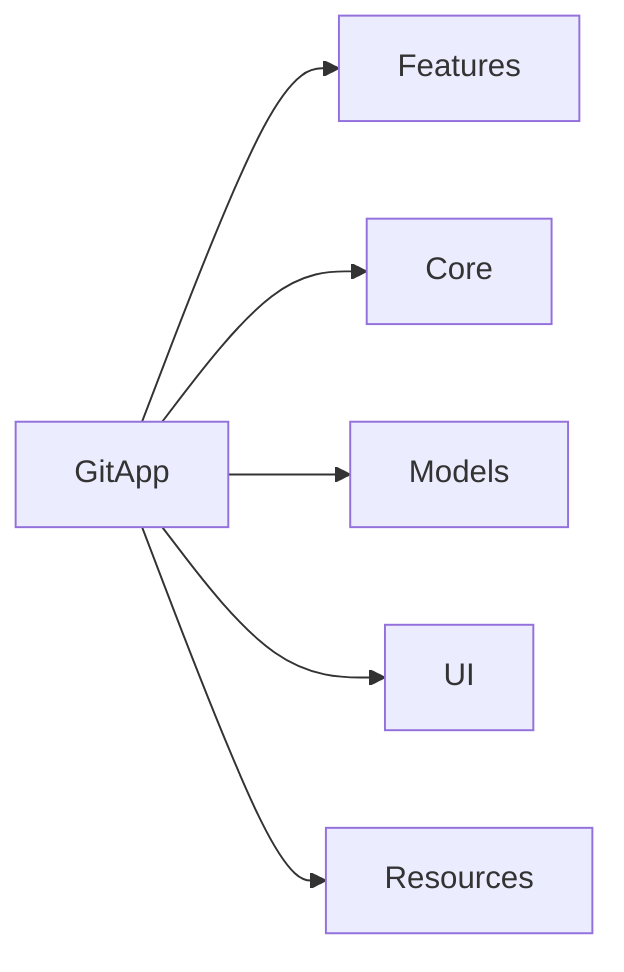
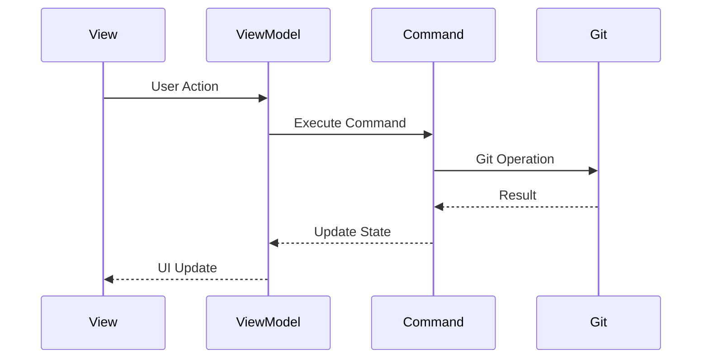

# 🚀 GitApp - Modern Git Client for macOS

<div align="center">


A modern, SwiftUI-based Git client that brings the power of Git to your fingertips with a beautiful, intuitive interface.

[Features](#-key-features) • [Architecture](#-architecture) • [Installation](#-getting-started) • 


</div>


## 🎯 Key Features

- Repository Management
- Branch Operations
- Commit History
- File Diff Viewing
- Stash Management
- Tag Management
- Merge Operations
## 🏗 Architecture

The project follows MVVM (Model-View-ViewModel) architecture with a clear separation of concerns:



### Core Components



## 📁 Project Structure

```
GitApp/
├── Features/
│   └── Git/
│       ├── Views/
│       │   ├── Components/
│       │   ├── Commits/
│       │   ├── FilesViews/
│       │   └── SideBar/
│       └── ViewModels/
├── Core/
│   └── Commands/
│       ├── GitBasicOperations/
│       ├── GitBranch/
│       ├── GitCommit/
│       ├── GitDiff/
│       ├── GitMerge/
│       ├── GitRestore/
│       ├── GitStash/
│       └── GitTags/
├── Models/
└── Resources/
```

## 🔄 Data Flow




## 📦 Core Components

### Models

- `Branch`: Branch information and operations
- `Commit`: Commit data structure
- `Diff`: File difference representation
- `FileDiff`: Detailed file changes
- `Status`: Repository status
- `Stash`: Stash operations
- `Tag`: Tag management

### Commands

- Basic Operations (clone, checkout, reset)
- Branch Management
- Commit Operations
- Diff Generation
- Merge Handling
- Stash Operations
- Tag Management

### ViewModels

- `GitViewModel`: Main Git operations coordinator
- `RepositoryViewModel`: Repository management
- `LogStore`: Commit history management
- `SyncState`: Repository synchronization state


## 🛠 Technical Stack

- SwiftUI for UI
- Swift Concurrency (async/await)
- Combine for reactive programming
- Git command-line interface integration
- Modern Swift features and best practices


## 📱 Requirements

- macOS 14.0+
- Xcode 16.0+
- Swift 5.7+

## 🚀 Getting Started

1. Clone the repository
2. Open `GitApp.xcodeproj`
3. Build and run the project

## 📝 License

This project is licensed under the MIT License - see the [LICENSE](LICENSE) file for details.

## 👥 Contributing

